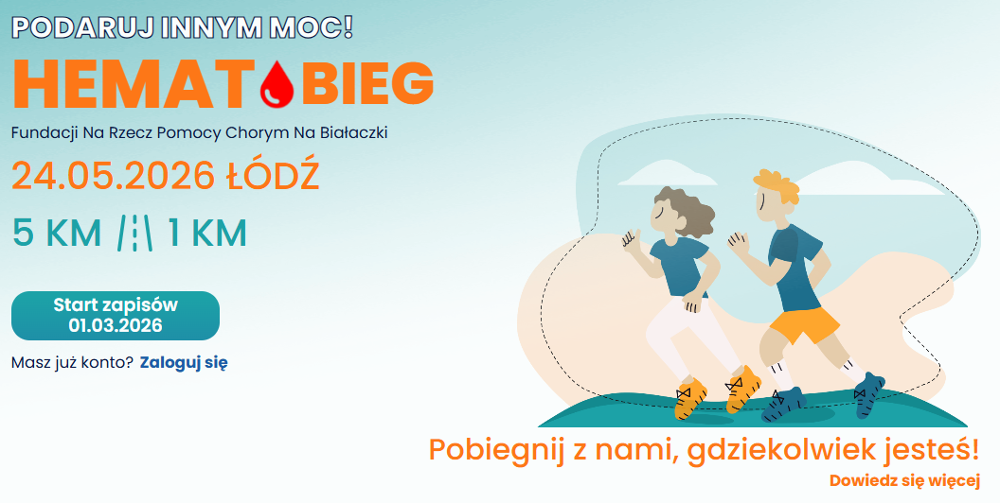
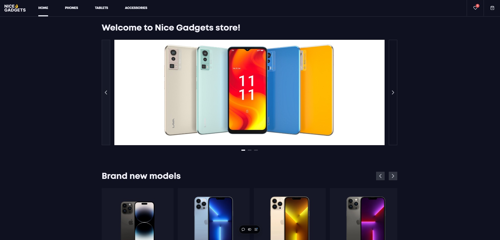
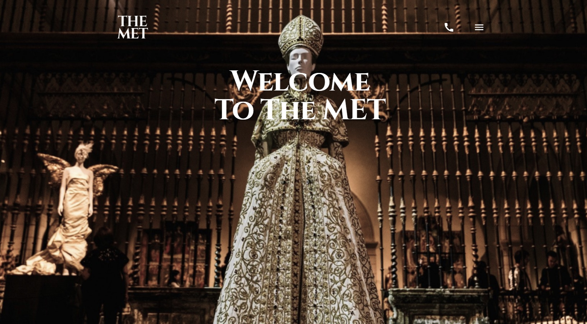
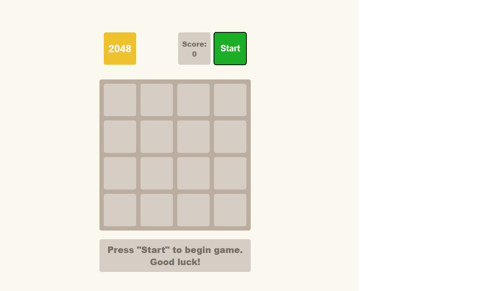
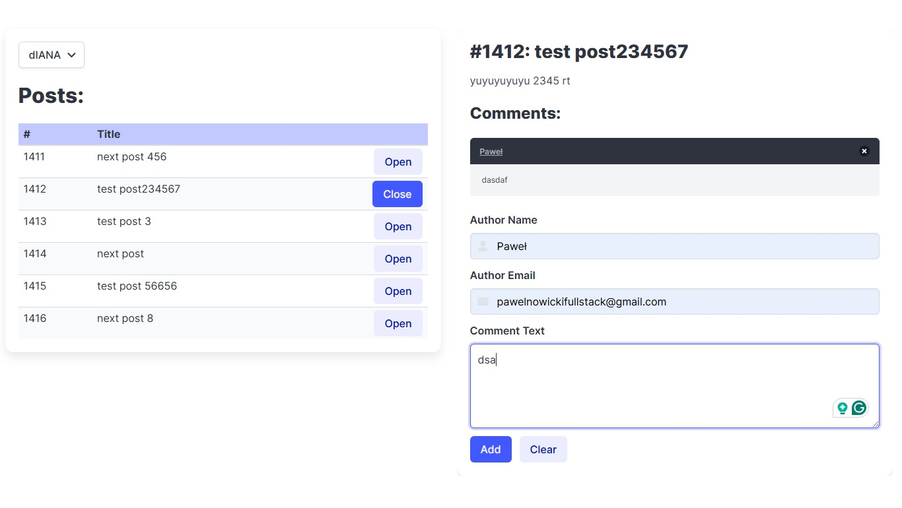
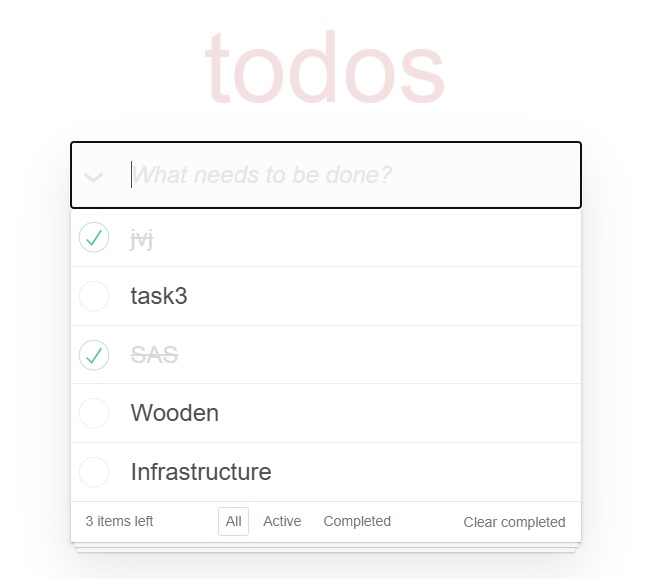

# Hi, I'm **Paweł Nowicki** - **Full-Stack Developer** !

I’m a passionate **Full-Stack Developer** with a knack for crafting robust, scalable applications and solving complex problems. Always 
curious, 
learning, 
and 
coding.

---

## **About Me**
- I’m currently working on building **innovative web applications** that make a real-world impact.
- Learning never stops: diving deeper into **.NET Core**, **C#**, **MVC Model**.
- Open to collaboration on exciting **open-source** or **team projects**. Let’s build something together!
- Fun fact: I love **watching movies, playing games**, exploring new places, and always pushing my skills to the next level.

---

## 🛠️ **Tech Stack**

### 🌐 Frontend

### 🖥️ Backend

### 📖 Currently Learning

### 🛠️ Tools & Platforms
  
  

---

## 🖥️ **Projects**

<table>
<tr>
    <td align="center">
    <strong>Hematorun</strong>  
    <a href="https://hematobieg.org">Demo</a> 
    
  </td>
  <td align="center">
    <strong>Phone Catalog (React)</strong>  
    <a href="https://phone-catalog-react.vercel.app">Demo</a> · <a href="https://github.com/pawelnowicki87/phone_catalog_react">GitHub</a>  
    
  </td>
  <td align="center">
    <strong>Welcome to the Met</strong>  
    <a href="https://pawelnowicki87.github.io/welcome_to_the_met/">Demo</a> · <a href="https://github.com/pawelnowicki87/welcome_to_the_met">GitHub</a>  
    
  </td>
  <td align="center">
    <strong>2048 Game</strong>  
    <a href="https://pawelnowicki87.github.io/2048_game/">Demo</a> · <a href="https://github.com/pawelnowicki87/2048_game">GitHub</a>  
    
  </td>
</tr>
<tr>
  <td align="center">
    <strong>List of Posts (React + Redux)</strong>  
    <a href="https://pawelnowicki87.github.io/list_of_posts_react_redux/">Demo</a> · <a href="https://github.com/pawelnowicki87/list_of_posts_react_redux">GitHub</a>  
    
  </td>
  <td align="center">
    <strong>Todo App with API (React)</strong>  
    <a href="https://pawelnowicki87.github.io/todo_app_with_api_react/">Demo</a> · <a href="https://github.com/pawelnowicki87/todo_app_with_api_react">GitHub</a>  
    
  </td>
  <td align="center"></td>
</tr>
</table>

---

## 🌍 **Quotes I Live By**
> “The best way to predict the future is to create it.” – Abraham Lincoln  
> **Mój komentarz**: Właśnie dlatego tworzę i rozwijam projekty, które mają wpływ na rzeczywistość.  
> “If you want to be smarter, you need to surround yourself with people smarter than you.”

---

## 📫 **Let's Connect!**

I’d love to hear from you! 🚀 Feel free to reach out and let's collaborate on something amazing. 

- 💌 Email: [pawelnowickifullstack@gmail.com](mailto:pawelnowickifullstack@gmail.com)
- 💼 LinkedIn: [Paweł Nowicki](https://www.linkedin.com/in/pawe%C5%82-nowicki-305380268/)
- 🌐 GitHub Portfolio: [pawel-nowicki](https://github.com/pawelnowicki)

